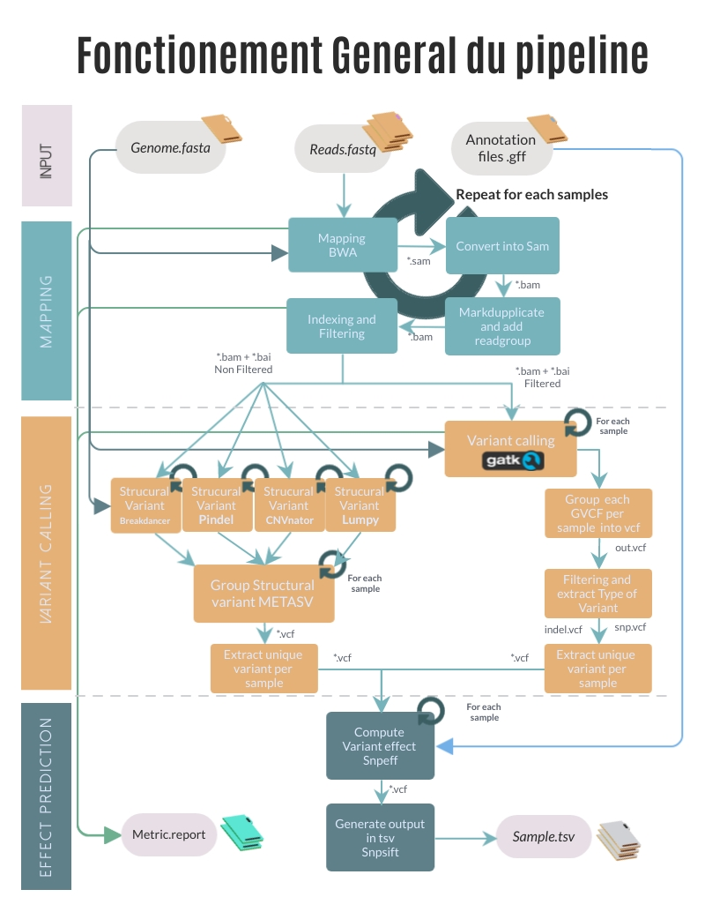

# Parallel genomic variant calling and prediction of functional impacts

Improve and speed-up your forward genetics by listing all mutations in several samples at a time !

### Content
  1. [Introduction](https://github.com/Romumrn/Pipeline_variant_RDP#introduction)
  2. [Pipeline overview](https://github.com/Romumrn/Pipeline_variant_RDP#pipeline-overview-technical-description)
  3. [Requirements](https://github.com/Romumrn/Pipeline_variant_RDP#requirements)
  4. [General Usage](https://github.com/Romumrn/Pipeline_variant_RDP#general-usage)
  5. [Input files and parameters](https://github.com/Romumrn/Pipeline_variant_RDP#input-files-and-parameters)
  6. [Example](https://github.com/Romumrn/Pipeline_variant_RDP#example)

## Introduction

This pipeline is designed to automatically provide the most exhaustive and accurate possible list of genes affected by genomic variations (e.g. natural polymorphisms, mutations) *specific* to a sample's DNA, using Illumina paired-end sequencing data. 

The output is a user-friendly tsv table that can be parsed and filter with classical spreadsheet software (LibreOffice, Excel, ...). This table is sorted by gene and predicts functional impact(s) on the gene of the identified genomic variation(s) to help biologists find the best candidates genes modified in the sample(s) provided.

The two main strengths of this pipeline are:
- **Automatic parallel analysis of a cohort of samples**: several samples' sequencing data can be provided at once and the pipeline automatically select genomic variations that are specific to each sample of the cohort. For example, in a mutagenesis experiment with a control strain" and several derived mutant strains, all inherited mutations from the control strain" will be discarded. This parallel analysis and multiple pairwise comparisons significantly **improve the specificity of the mutation search** by reducing false positive rate, while the automation of the workflow makes it easily scalable to large cohorts.
- **Exhaustive variant calling**: the pipeline automatically combines several variant callers to cover a **large spectrum of possible genomic variations**, from single nucleotide polymorphisms (**SNP**) up to **structural variations** (SV) of several kbps (deletions, insertions, inversions, translocations, etc...). This improves variant calling accuracy and resolution, especially for SV, while again pipeline automation ensure a simple workflow for biologist end users.

The pipeline is implemented in [Nextflow](https://www.nextflow.io/): it's very easy to install and allows to monitor the completion of all processes of the pipeline, can be deployed in clusters/clouds for parallel computing, it ensures reproducible analysis (simple configuration, supports Docker technology, keeps track of command lines and parameters), promotes efficient re-run and debugs, generates reports.

In theory, it can be used on every organisms for which a reference genome and annotation files are available (flexible input data provided by the user).
Organisms in which the pipeline has been tested: *Arabidopsis thaliana*, *Physcomitrium patens*.

## Pipeline overview (technical description)
This pipeline has 3 major parts:

- Mapping and processing reads : Mapping reads from different mutated samples against reference genome with bwa mem. After that, sam file are filtering and annotate with samtools and picardtools.

- Variant Calling: A variant calling of short variants, snp and short indels, with [GATK](https://gatk.broadinstitute.org/hc/en-us/articles/360037225632-HaplotypeCaller). And a structural variant calling, with pindel, Breakdancer, CNVnator, Lumpy combined with [metaSV](https://github.com/bioinform/metasv). If several samples are provided together, only variants unique to each strain will be selected, increasing specificity of the genomic variation profiling.


- Effet prediction: A prediction of variant effects with [snpeff](http://pcingola.github.io/SnpEff/).




## Installation

### Conda
In order to use the virtual environnement, you fisrt need to have anaconda. You can find all the information you need on the links below :
https://docs.conda.io/projects/conda/en/latest/user-guide/install/index.html#regular-installation

#### Linux
https://docs.conda.io/projects/conda/en/latest/user-guide/install/linux.html

#### Windows
https://docs.conda.io/projects/conda/en/latest/user-guide/install/windows.html

#### macOS
https://docs.conda.io/projects/conda/en/latest/user-guide/install/macos.html

### Virtual Environnement
Once conda is installed, you need to get the virtual environnement containing all the dependencies of this one.
The packages needed are listed in the requirements.yml file.
Run the install_env script with bash in interactive mode using the -i option: 

```
bash -i install_env.sh
```

## Requirements

### Software
You will need to install first:
- Nextflow ([How to install nextflow](https://www.nextflow.io/docs/latest/getstarted.html) in three little steps ! ).

> note
> 
> As explained in the link, we recommand to place the nextflow binary executable file at a location accessible to your $PATH. Alternatively, you can permanently edit your $PATH. For example, in a bash shell, execute: `echo 'export PATH=$PATH:/path/to/nextflow'  >> ~/.bash_profile` (in a sh and ksh shell, `echo 'export PATH=$PATH:/path/to/nextflow' >> ~/.profile`)

- Plotly (python3 -m pip install plotly --user)

- just git clone or copy this repository (not install or compilation required !)

### Input data
The sequencing data are typically **Illumina paired-end** sequencing fastq files generated from the genomic DNA of a unique strain.
Retained genomic variations are only **homozygous positions**. Both haploid and diploid organisms can be studied.

The sequence of the reference genome of the organism is required at the *fasta* format, annotation file is required at the *gff* format.

## General Usage

So far, we have implemented a single workflow called `VariantCaller.nf`. This pipeline can be called using the following command:

```
nextflow run -profile [psmn,singularity] VariantCaller.nf \
-c file.config \
--reads "reads/*_{1,2}.fq.gz" \
--genomefasta genome.fa \
--annotation genome_annotation.gff \
--outdir My_analyse \
```
> Note
> 
> if `nextflow` is not contained in a folder of your $PATH, modify the start of the above command line with `./path/to/nextflow`

We recommand to run nextflow using a *screen* or *tmux* terminal to avoid killing the workflow if the terminal closes by accident.

Example with tmux :
```
# Open a new terminal
tmux
# run nextflow
nextflow run -c -profile
# "Detach" terminal (the terminal vanishes from the screen but do not stop, so the running process is not killed)
ctrl+B (simultaneous keys) then type 'd'
# "Attach" terminal (re-open the remote terminal session which is still active)
tmux attach
```

## Input files and parameters

### Configuration file
First define the config file of your analysis workflow.
Copy and paste the default config file provided in `Pipeline_variant_RDP/script/VariantCaller.config` to your analysis folder.

> note
> 
>  Only two profiles are defined in the second part of the config file. The pipeline has been optimized to run in our lab computing cluster. Running in an other environment may require to create a new profile. Expertise in nextflow is preferable to edit the profile configurations.

The configuration file must be given to the command line with the -c option:
- `-c` : + path to configuration file. The provided config file contains all default values and configurations for runs at our lab cluster ([PSMN](http://www.ens-lyon.fr/PSMN/doku.php)). 

Most of the main paramters can be either directly configured at the beginning of this config file. Alternatively, they can be specified in the command line as explained below.

### Main parameters
- `-profile` : + *profile id (string)*. the profile adapted to your computing environment, deined in the config file (available: psmn or singularity)

- `VariantCaller.nf`: (nothing to add). The typical pipeline to be executed (only one available), located in scrpitdir

- `--scriptdir` : + *path/to/directory*. Path to the directory that contains the pipeline scripts. For example /Pipeline_variant_RDP/script'

- `--genomefasta` : + *path/to/file*. Full path to the file of the reference genome (.fa or .fasta or .gz)

- `--reads` : + *path/to/files*. Full path to directory and name of reads in fastq.gz. Only one argument is accepted, so you should use a pattern to select several files. Symbolic links are accepted, so you can group symlinks to sequencing files of a cohort to analyze in a dedicated folder of your analysis.
Example: "Sequence* _{1,2}.fastq" ( `{1,2}` for paired reads ). (Use quotes "" to ensure the correct interpretation of pattern)

or 

- `--readsinbam` : + path/to/files. Full path to directory and name of your reads in .bam. Only one argument is accepted, so you should use a pattern to select several files. You can provide your own bam from different experimentation with different readgroup. (RGSM should be the same name of your file exemple : "RGSM=SOMETHING" SOMETHING.bam )
Example: "Sequence*.bam" (Use quotes "" to ensure the correct interpretation of pattern)

> Important note :
>
> Some databases are already included in our [snpEff docker image](https://hub.docker.com/r/romudock/snpeff) : _Arabidopsis thaliana_, _Physcomitrella_patens_, _Caenorhabditis elegans_, _Caenorhabditis briggsae_, _Populus trichocarpa_, _Zea mays_, _Drosophila melanogaster_, _Saccharomyces cerevisiae_ and _Schizosaccharomyces_pombe_. For these species you do not need to provide an annotation file: instead, use the option `--annotationname` followed by the organism's name recognized by snpEff:
> 
- `--annotationname` : + name (string). Name of the organism (with a underscore instead of space) either Arabidopsis_thaliana, Physcomitrella_patens, Caenorhabditis_elegans, Caenorhabditis_briggsae, Populus_trichocarpa, Saccharomyces_cerevisiae, Zea_mays, Drosophila_melanogaster, Schizosaccharomyces_pombe

> If your model organism is not already included, you can provide an annotation file. Warning ! It can be risky because annotation files can be not well formatted and not supported by the snpEff program.

- `--annotationgff` : + *path/to/file*. Full path to file of annotation genome (.gff format)


### Optional parameters:

- `--vqsr_file` : + path/to/file. You can provide a reference variant file (.vcf) in order to apply a variant recalibration score with [GATK](https://gatk.broadinstitute.org/hc/en-us/articles/360035531612-Variant-Quality-Score-Recalibration-VQSR-). Note that this file must contain a lot of highly validated trusty variants to ensure a good performance of the classification algorithms. For exemple [Arabidopsis_thaliana]( https://1001genomes.org/data/GMI-MPI/releases/v3.1/).

- `--sampletable`: + path/to/file. In order to simplify result file naming, you can provide a table of correspondance between your regular sample names and the (often complicated) names of corresponding read (fastq) files in csv format. Example:
```
V300042688_L2_AE06084935-608,Mutant1
V300042688_L4_AE49584879-612,Mutant2
V300042688_L4_AE47136387-610,Mutant3
```

- `--outdir` : + path/to/destination/directory. Name of the main result directory generated by the analysis. Default: './results'

- `--ploidy` : + numeric. Number of chromosome copy. Default: 1 (1 or 2)

- `--minglobalqual` : + numeric. (only for short indel and snp) Minimal cutoff threshold of global quality per variant (for all sample). Default: 200

- `--mindepth` : + numeric. (only for short indel and snp) Minimal cutoff threshold of depth (number of reads) for a variant per sample. Default: 4

- `-resume` : (nothing to add). With this flag, previously generated files from other analysis that are strictly identical to this new worflow will be retrieved from the cache, save computation time and ressource !

- `with-report`: +path/to/destination. Output an html execution report of the workflow (https://www.nextflow.io/docs/latest/tracing.html#execution-report)


## Example 

**Command line** : 

```
./nextflow run script/VariantCaller.nf -c script/VariantCaller.config -profile psmn \
--reads "/home/rmarin/Mydata/V30001743*{1,2}.fq.gz" \
--genomefasta Mydata/Arabidopsis_thaliana.TAIR10.31.dna.toplevel.fa \
--vqsrfile Mydata/1001genomes_snp-short-indel_only_ACGTN.vcf.gz \
--annotationname 'Arabidopsis_thaliana' \
--outdir My_analyse
```
with this command line, the beginning of the configuration file specifying the main parameters should look like:

**Configuration file:**
```
// Configuration file 

params {
  // Path to directory who contain script. For example /Pipeline_variant_RDP/script.nf'
  scriptdir = 'script' 

  // Full path to file of reference genome (.fa or .fasta or .gz)
  genomefasta = false //given in the command line

  //Full path to directory and name of reads in fastq.gz. You can use a pattern to select several files. Example : Sequence*_{1,2}.fastq
  reads = false //given in the command line
  
  //You can provide your own annotation file with `--annotationgff` or you can use snpeff database. 
  //Only for Physcomitrella patens or Arabidopsis thaliana ! In this case use `--annotationname`
  annotationgff = false // Full path to file of annotation genome (.gff)
  annotationname = false // [ 'Physcomitrella_patens' , 'Arabidopsis_thaliana', or false ]

  //Number of chromosome copy. Default: 1 (1 or 2)
  ploidy = 2 // 1 or 2, set to 2 for Arabidopsis thaliana here

  //You can provide a reference of good variant file (.vcf) in order to apply a variant recalibartion score. 
  //For exemple [Arabidopsis_thaliana]( https://1001genomes.org/data/GMI-MPI/releases/v3.1/)
  vqsrfile = false // given in command line
  vqsrrate = 99.0

  sampletable = false
  outdir = 'results' //overwritten by command line argument
  minglobalqual = 200 // per cohort
  mindepth = 4 // per sample

  help = false
}
```
**Corresponding organization of input files, scripts, and nextflow executable**:
```
.
├── Mydata
│   ├── 1001genomes_snp-short-indel_only_ACGTN.vcf
│   ├── Arabidopsis_thaliana.TAIR10.31.dna.toplevel.fa
│   ├── V300017433_L4_B5GARAwyvRAAAAABA-501_1.fq.gz
│   ├── V300017433_L4_B5GARAwyvRAAAAABA-501_2.fq.gz
│   ├── V300017433_L4_B5GARAwyvRAAABABA-502_1.fq.gz
│   └── V300017433_L4_B5GARAwyvRAAABABA-502_2.fq.gz
├── script
│   ├── breakdancer2vcf.py
│   ├── extract_specific.py
│   ├── extract_specific_SV.py
│   ├── extractSplitReads_BwaMem
│   ├── extractsvlen.py
│   ├── fastq_sample.py
│   ├── graph_qual_fromraw copy.py
│   ├── graph_qual_fromraw.py
│   ├── splitfa.py
│   ├── testmappingbowtie2.nf
│   ├── testmapping.nf
│   ├── VariantCaller.config
│   └── VariantCaller.nf
└── nextflow
```
